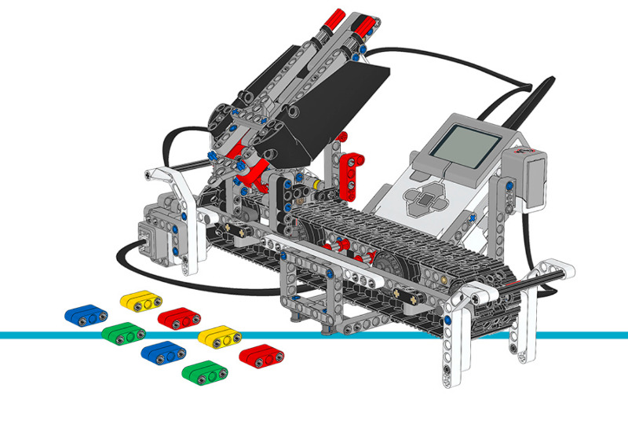

カラーソーター
================

このサンプルプロジェクトでは、カラーソーターが
:class:`ColorSensor <pybricks.ev3devices.ColorSensor>`
を使って色付きのTechnicビームをスキャンします。

色付きのビームを1本ずつスキャンしてトレイに入れます。
ビープ音は色が登録されたことを示します。トレイがいっぱいになるか中央ボタンを押すと、
ロボットが色ごとにTechnicブロックを仕分けし始めます。

.. rubric:: 組み立て説明書

`こちら <here_>`_ からコアセットモデルの組み立て説明書をすべて確認できます。また、
`このリンク <this link_>`_ からカラーソーターの説明書に直接アクセスできます。

.. _fig_color_sorter:

   カラーソーター

.. rubric:: サンプルプログラム

.. literalinclude::
   ../../../pybricks-projects/official_models/ev3/education_core/color_sorter/main.py

.. _here: https://education.lego.com/en-us/support/mindstorms-ev3/building-instructions#building-core
.. _this link: https://le-www-live-s.legocdn.com/sc/media/lessons/mindstorms-ev3/building-instructions/ev3-model-core-set-color-sorter-c778563f88c986841453574495cb5ff1.pdf
