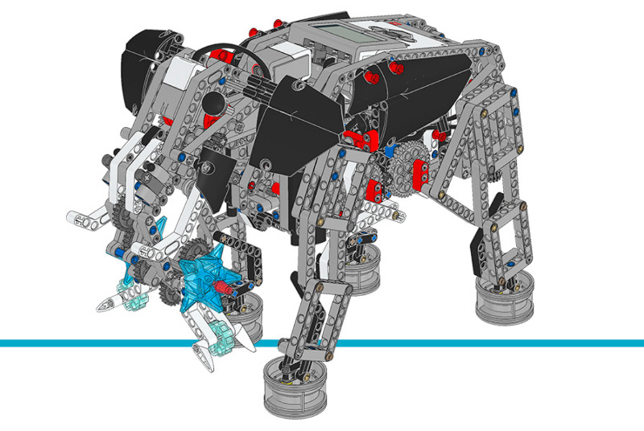

エレファント
================

このサンプルプロジェクトでは、EV3 Brickのボタンを押すと、
エレファントが歩いたり鼻を上げたり音を鳴らしたりします。

.. rubric:: 組み立て説明書

`こちら <here_>`_ から拡張セットモデルの組み立て説明書をすべて確認できます。また、
`このリンク <this link_>`_ からエレファントの説明書に直接アクセスできます。

.. _fig_elephant:

   エレファント

.. rubric:: サンプルプログラム

.. literalinclude::
   ../../../pybricks-projects/official_models/ev3/education_expansion/elephant/main.py

.. _here: https://education.lego.com/en-us/support/mindstorms-ev3/building-instructions#building-expansion
.. _this link: https://le-www-live-s.legocdn.com/sc/media/lessons/mindstorms-ev3/building-instructions/model-expansion-set/ev3-model-expansion-set-elephant-3c8304efe699169ffe82b85cb01a01cb.pdf
