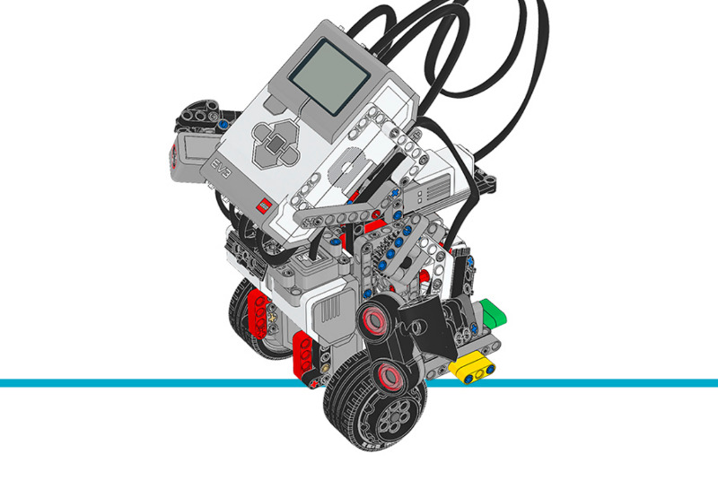

ジャイロボーイ
================

このプログラムは、ジャイロボーイが
:class:`GyroSensor <pybricks.ev3devices.GyroSensor>`
を使って2つの車輪でバランスを取れるようにします。バランスを維持するために、
ジャイロの角度・ジャイロの速度・モーターの角度・モーターの速度の関数として、
モーターのデューティー比を継続的に調整します。

このプログラムは、Pythonのジェネレーター関数(returnの代わりにyieldを使う関数)を
コルーチンとしても使っています。コルーチンは協調的マルチタスクの一種で、
ロボットが複数のタスクを同時に実行できるようにします。これにより、
バランスを取っている最中でもロボットを走行させることができます。

.. rubric:: 組み立て説明書

`こちら <here_>`_ からコアセットモデルの組み立て説明書をすべて確認できます。また、
`このリンク <this link_>`_ からジャイロボーイの説明書に直接アクセスできます。

.. _fig_gyro_boy:

   ジャイロボーイ

.. rubric:: サンプルプログラム

.. literalinclude::
   ../../../pybricks-projects/official_models/ev3/education_core/gyro_boy/main.py

.. _here: https://education.lego.com/en-us/support/mindstorms-ev3/building-instructions#building-core
.. _this link: https://le-www-live-s.legocdn.com/sc/media/lessons/mindstorms-ev3/building-instructions/ev3-model-core-set-gyro-boy-f8a14d8e3d0e63fa23b87f798bf197f4.pdf
