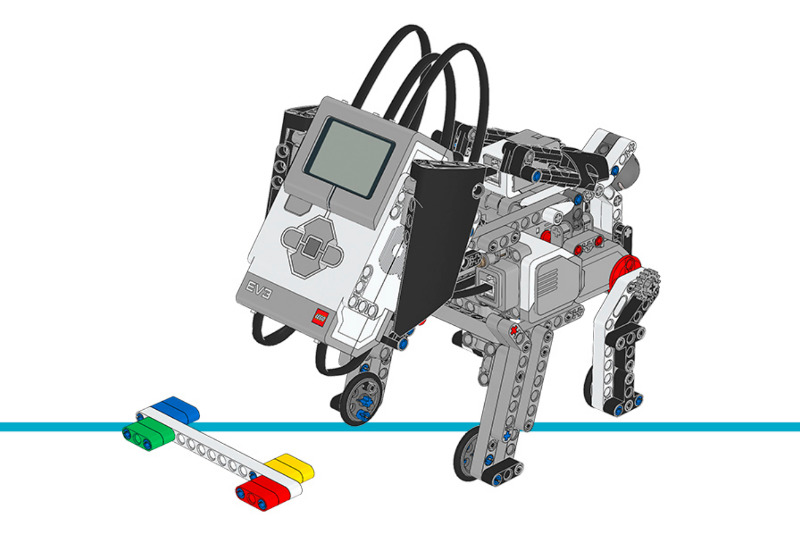

パピー
================

このサンプルプログラムでは、パピーに最大8種類の行動をさせます。エサをもらったとき
( :class:`ColorSensor <pybricks.ev3devices.ColorSensor>` が色を検出)や、
なでられたとき
( :class:`TouchSensor <pybricks.ev3devices.TouchSensor>` が押された)に応じて、
異なる行動をとります。

.. rubric:: 組み立て説明書

`こちら <here_>`_ からコアセットモデルの組み立て説明書をすべて確認できます。また、
`このリンク <this link_>`_ からパピーの説明書に直接アクセスできます。

.. _fig_puppy:

   パピー

.. rubric:: サンプルプログラム

.. literalinclude::
   ../../../pybricks-projects/official_models/ev3/education_core/puppy/main.py

.. _here: https://education.lego.com/en-us/support/mindstorms-ev3/building-instructions#building-core
.. _this link: https://le-www-live-s.legocdn.com/sc/media/lessons/mindstorms-ev3/building-instructions/ev3-model-core-set-puppy-7a316ae71b8ecdcd72ad4c4bcd15845d.pdf
