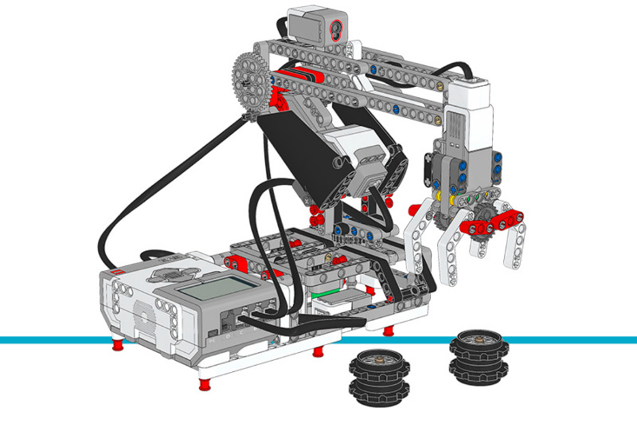

ロボットアーム H25
=====================

このサンプルプログラムでは、ロボットアーム H25が黒いホイールハブの
スタックをずっと動かし続けます。ロボットアームはまず初期化を行い、
その後ハブを動かし始めます。

.. rubric:: 組み立て説明書

`こちら <here_>`_ からコアセットモデルの組み立て説明書をすべて確認できます。また、
`このリンク <this link_>`_ からロボットアーム H25の説明書に直接アクセスできます。

.. tip::

   ロボットを組み立てるときは、microSDカードを抜き差ししやすいように、
   EV3 Brickの向きを逆にしてください。

.. _fig_robot_arm:

   ロボットアーム H25

.. rubric:: サンプルプログラム

.. literalinclude:: ../../../pybricks-projects/official_models/ev3/education_core/robot_arm/main.py

.. _here: https://education.lego.com/en-us/support/mindstorms-ev3/building-instructions#building-core
.. _this link: https://le-www-live-s.legocdn.com/sc/media/lessons/mindstorms-ev3/building-instructions/ev3-model-core-set-robot-arm-h25-56cdb22c1e3a02f1770bda72862ce2bd.pdf
