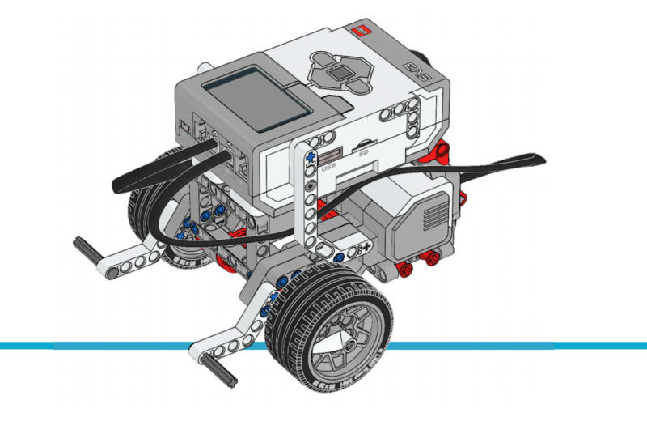

基本的な動き
=====================

このサンプルプロジェクトでは、ロボット車両を指定した距離だけ走行させたり、
指定した角度だけ旋回させたりする方法を紹介します。正確な動作のコツについては、
:class:`.DriveBase` クラスを参照してください。

.. rubric:: 組み立て説明書

`こちら <here_>`_ からEducator Botの組み立て説明書をすべて確認できます。また、
`このリンク <this link_>`_ からドライビングベースの説明書に直接アクセスできます。

.. _fig_robot_educator_basic:

   ロボットエデュケーター

.. rubric:: サンプルプログラム

.. literalinclude::
   ../../../pybricks-projects/official_models/ev3/education_core/robot_educator_basic/main.py

.. _here: https://education.lego.com/en-us/support/mindstorms-ev3/building-instructions#robot
.. _this link: https://le-www-live-s.legocdn.com/sc/media/lessons/mindstorms-ev3/building-instructions/ev3-rem-driving-base-79bebfc16bd491186ea9c9069842155e.pdf
