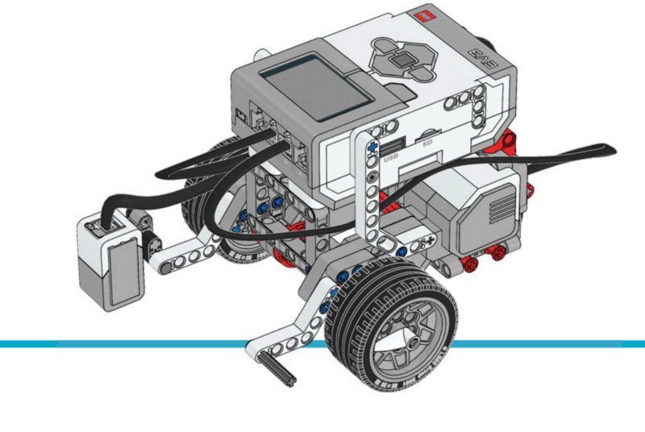
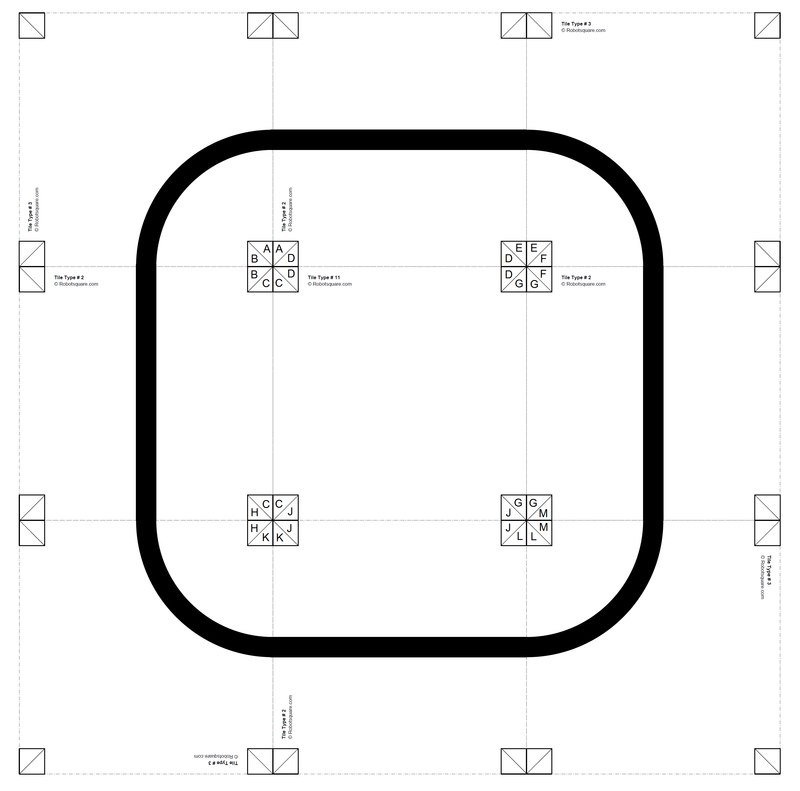

ライントレース
=====================

このサンプルプロジェクトでは、
:class:`ColorSensor <pybricks.ev3devices.ColorSensor>` と
:class:`.DriveBase` クラスを使って、ロボット車両にラインをトレースさせる方法を紹介します。
測定した反射光がしきい値からどれだけずれているかに応じて旋回速度を調整することで動きます。
しきい値は、ラインの反射光と周囲の表面の反射光の平均として設定します。

.. rubric:: 組み立て説明書

`こちら <here_>`_ からEducator Botの組み立て説明書をすべて確認できます。また、
`このリンク <this link_>`_ からカラーセンサーアタッチメントの説明書に直接アクセスできます。

.. _fig_robot_educator_line:

   カラーセンサーを取り付けたロボットエデュケーター

.. rubric:: サンプルプログラム

この例では :numref:`fig_map` に示すトラックを使いますが、
他のラインをトレースするように応用することもできます。下のリンクから
ライントレース用のトラックをダウンロードして、必要なページを印刷してください。
他のページを印刷して、自分だけのトラックを作ることもできます。

:download:`こちらからライントレース用のトラックをダウンロード。 <../images/linefollowtiles.pdf>`

.. _fig_map:

   ライントレース用のトラックをダウンロードして、ページ
   ``2,2,2,2,3,3,3,3,11`` を印刷します。

.. literalinclude::
   ../../../pybricks-projects/official_models/ev3/education_core/robot_educator_line/main.py

.. _here: https://education.lego.com/en-us/support/mindstorms-ev3/building-instructions#robot
.. _this link: https://le-www-live-s.legocdn.com/sc/media/lessons/mindstorms-ev3/building-instructions/ev3-rem-color-sensor-down-driving-base-d30ed30610c3d6647d56e17bc64cf6e2.pdf
