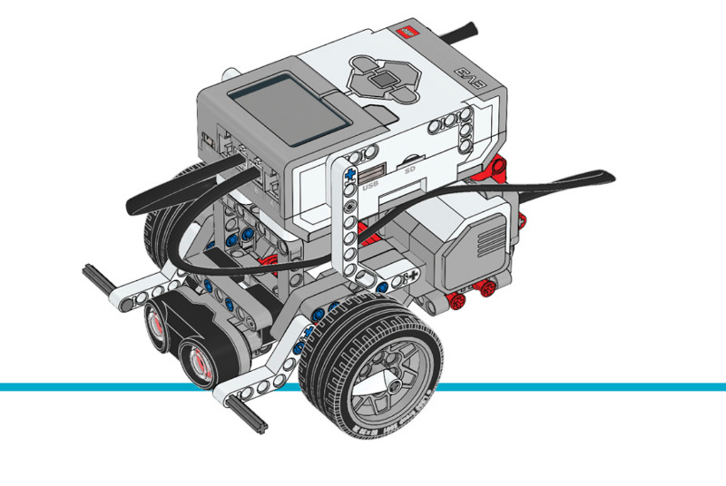

障害物回避
=====================

このサンプルプロジェクトでは、センサーを使ってロボット車両を周囲の環境に
反応させる方法を紹介します。ロボットは一定の速度で走行し、
:class:`UltrasonicSensor <pybricks.ev3devices.UltrasonicSensor>`
で障害物を検出すると、
バックして向きを変え、新しい障害物を検出するまで走行を続けます。

.. rubric:: 組み立て説明書

`こちら <here_>`_ からEducator Botの組み立て説明書をすべて確認できます。また、
`このリンク <this link_>`_ から超音波センサーアタッチメントの説明書に直接アクセスできます。

.. _fig_robot_educator_ultrasonic:

   超音波センサーを取り付けたロボットエデュケーター

.. rubric:: サンプルプログラム

.. literalinclude::
   ../../../pybricks-projects/official_models/ev3/education_core/robot_educator_ultrasonic/main.py

.. _here: https://education.lego.com/en-us/support/mindstorms-ev3/building-instructions#robot
.. _this link: https://le-www-live-s.legocdn.com/sc/media/lessons/mindstorms-ev3/building-instructions/ev3-ultrasonic-sensor-driving-base-61ffdfa461aee2470b8ddbeab16e2070.pdf
