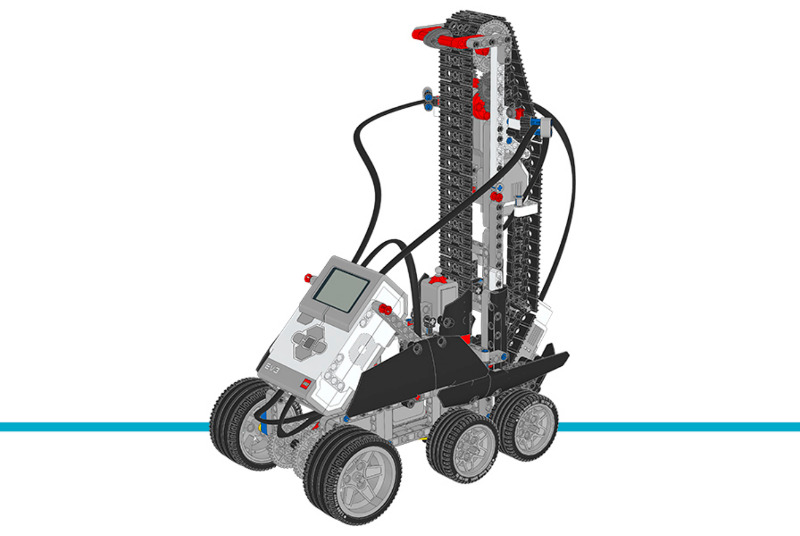

ステアクライマー
=================

このサンプルプロジェクトでは、ステアクライマーがEV3 Brickのボタンで選んだ
段数の階段を上ります。詳しくは、下のプログラム内のコメントも確認してください。

.. rubric:: 組み立て説明書

`こちら <here_>`_ から拡張セットモデルの組み立て説明書をすべて確認できます。また、
`このリンク <this link_>`_ からステアクライマーの説明書に直接アクセスできます。

.. _fig_stair_climber:

   パピー

.. rubric:: サンプルプログラム

.. literalinclude::
   ../../../pybricks-projects/official_models/ev3/education_expansion/stair_climber/main.py

.. _here: https://education.lego.com/en-us/support/mindstorms-ev3/building-instructions#building-expansion
.. _this link: https://le-www-live-s.legocdn.com/sc/media/lessons/mindstorms-ev3/building-instructions/model-expansion-set/ev3-model-expansion-set-stair-climber-8f4d9f19b87fa2e37e28aebe2b24486b.pdf
