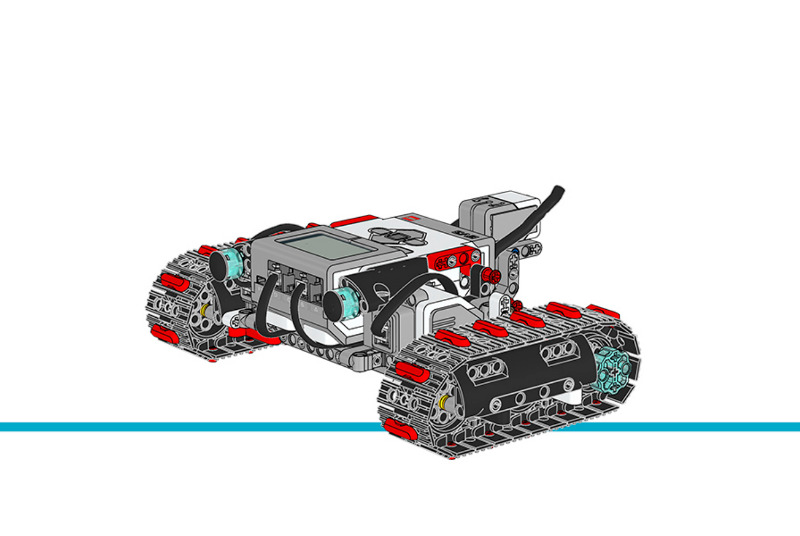

タンクボット
================

このサンプルプロジェクトでは、
:class:`GyroSensor <pybricks.ev3devices.GyroSensor>`
をタンクボットで使って正確に旋回する方法を紹介します。
押すEV3 Brickのボタンによって、ロボットは三角形・正方形・五角形・六角形に走行します。

.. rubric:: 組み立て説明書

`こちら <here_>`_ から拡張セットモデルの組み立て説明書をすべて確認できます。また、
`このリンク <this link_>`_ からタンクボットの説明書に直接アクセスできます。

.. _fig_tank_bot:

   タンクボット

.. rubric:: サンプルプログラム

.. literalinclude::
   ../../../pybricks-projects/official_models/ev3/education_expansion/tank_bot/main.py

.. _here: https://education.lego.com/en-us/support/mindstorms-ev3/building-instructions#building-expansion
.. _this link: https://le-www-live-s.legocdn.com/sc/media/lessons/mindstorms-ev3/building-instructions/model-expansion-set/ev3-model-expansion-set-tank-bot-006a7f22d89c631c1d49fa27eccaf290.pdf
