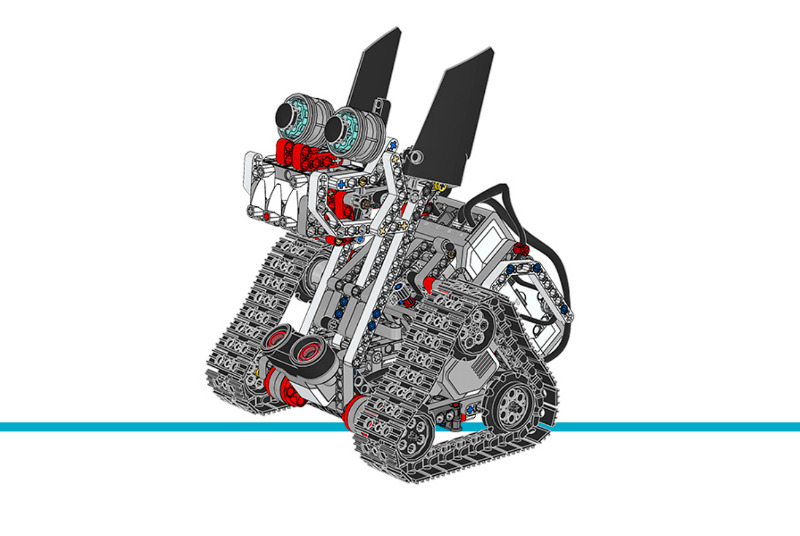

ズナップ
================

このサンプルプロジェクトでは、ズナップが障害物を避けながらランダムに動き回ります。
物体を検出すると、その物体までの距離に応じて異なる音を鳴らします。

.. rubric:: 組み立て説明書

`こちら <here_>`_ から拡張セットモデルの組み立て説明書をすべて確認できます。また、
`このリンク <this link_>`_ からズナップの説明書に直接アクセスできます。

.. _fig_znap:

   ズナップ

.. rubric:: サンプルプログラム

.. literalinclude::
   ../../../pybricks-projects/official_models/ev3/education_expansion/znap/main.py

.. _here: https://education.lego.com/en-us/support/mindstorms-ev3/building-instructions#building-expansion
.. _this link: https://le-www-live-s.legocdn.com/sc/media/lessons/mindstorms-ev3/building-instructions/model-expansion-set/ev3-model-expansion-set-znap-71b712c154ffb81ace8bf73384f2197c.pdf
