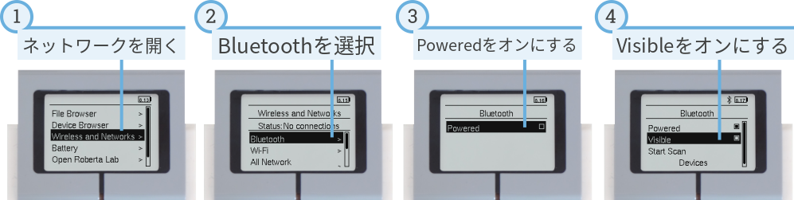
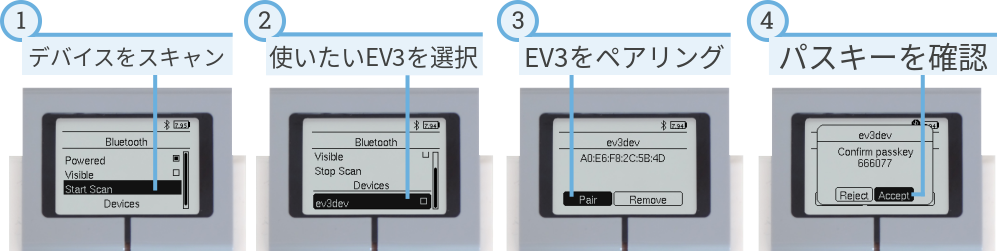
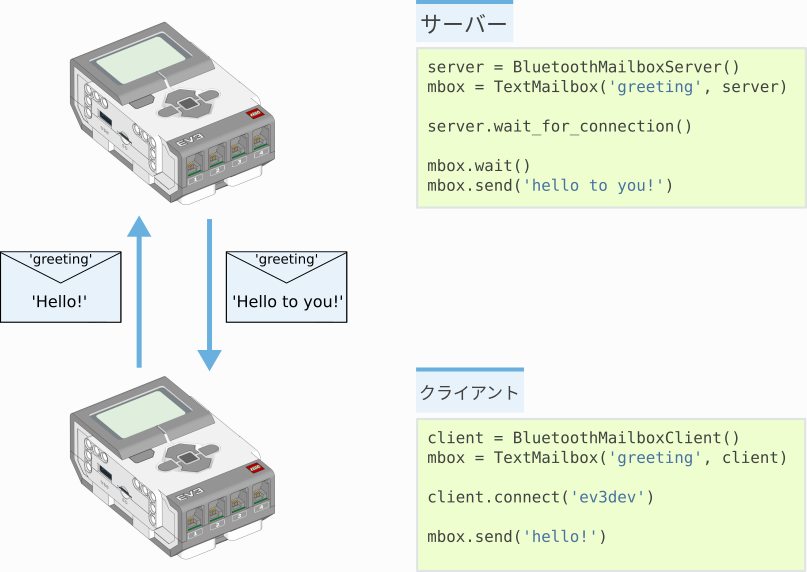
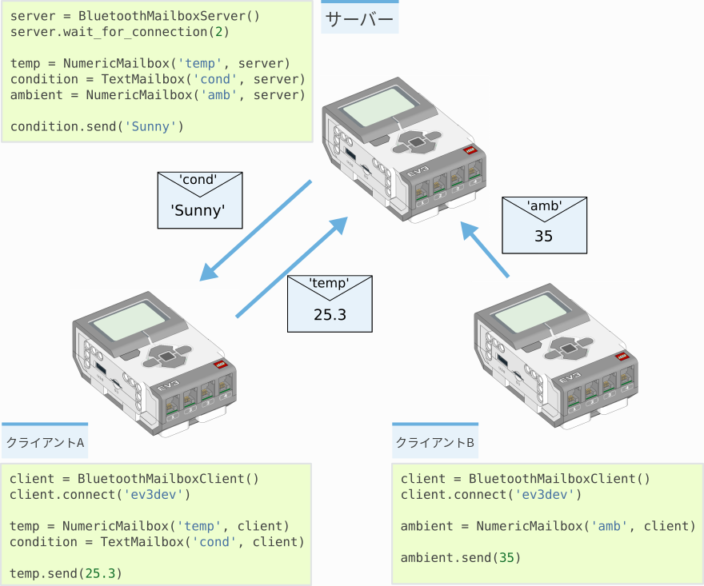

:mod:`messaging <pybricks.messaging>` -- メッセージング
================================================================

.. module:: pybricks.messaging

.. currentmodule:: pybricks.messaging

EV3ブロックはBluetoothを使って別のEV3ブロックに情報を送信できます。
このページでは、複数のブロックを接続する方法と、それらの間で
メッセージを送受信するスクリプトの書き方を紹介します。

2台のEV3ブロックをペアリングする
------------------------------------------------

2台のEV3ブロックがメッセージをやり取りするには、事前に *ペアリング*
が必要です。これは最初の1回だけ行えばよいものです。まず、
:numref:`fig_bluetooth_on` に示すようにすべてのEV3ブロックで
Bluetoothを有効にします。

.. _fig_bluetooth_on:

   Bluetoothをオンにし、Bluetoothを検出可能な状態にします。

次に、 :numref:`fig_bluetooth_pair` に示すように、片方のEV3ブロックから
もう片方を検索してペアリングします。

ペアリングが完了したら、表示されるメニューで *connect* は
クリックしないでください。
接続は、後述するようにプログラムを実行したときに確立されます。

.. _fig_bluetooth_pair:

   あるEV3ブロックを別のEV3ブロックにペアリングします。

Bluetoothデバイスをスキャンすると、デバイス名の一覧が表示されます。
既定では、すべてのEV3ブロックは *ev3dev* という名前になっています。
名前の変更方法は :ref:`こちら <hostname>` を参照してください。
名前を変えておくと、複数のブロックを区別しやすくなります。

3台以上のEV3ブロックをペアリングしたい場合は、
:numref:`fig_bluetooth_pair` の手順を繰り返します。

サーバーとクライアント
-----------------------------------

無線ネットワークは、サーバーまたはクライアントとして動作する
EV3ブロックで構成されます。
サーバー1台とクライアント1台の例を :numref:`fig_messaging` に
示します。
メッセージは双方向に送信できます。サーバーからクライアントへも、
クライアントからサーバーへも送信できます。

.. _fig_messaging:

   サーバー1台とクライアント1台からなるネットワークの例。

.. toggle-header::
    :header: **サーバーの完全な例を表示/非表示**

    **例: EV3 Bluetoothサーバー。**

    :numref:`fig_messaging` に示した抜粋の完全版です。

    .. literalinclude:: ../../pybricks-projects/snippets/ev3/bluetooth_server/server.py

.. toggle-header::
    :header: **クライアントの完全な例を表示/非表示**

    **例: EV3 Bluetoothクライアント。**

    :numref:`fig_messaging` に示した抜粋の完全版です。

    .. literalinclude:: ../../pybricks-projects/snippets/ev3/bluetooth_client/client.py

クライアントとサーバーの唯一の違いは、プログラムの冒頭でどちらが
接続を開始するかです。

    - **サーバー** は常に先に起動する必要があります。
      ``BluetoothMailboxServer`` クラスを使用し、
      ``wait_for_connection`` メソッドでクライアントを待ちます。
    - **クライアント** は ``BluetoothMailboxClient`` クラスを使用し、
      ``connect`` メソッドでサーバーに接続します。
    - その後のメッセージの送受信は、どちらのEV3ブロックでも同じ方法で
      行います。

.. autoclass:: BluetoothMailboxServer

.. autoclass:: BluetoothMailboxClient

メールボックス
-----------------------

メールボックスは、他のEV3ブロックとの間でデータを送受信するために
使います。

メールボックスには、メールの「件名」のような ``name`` があります。
2台のEV3ブロックが同じ名前のメールボックスを持っていれば、それらの間で
メッセージを送れます。各EV3ブロックは自分のメールボックスを読み取り、
相手のEV3ブロック上のメールボックスへメッセージを送信できます。

やり取りしたいメッセージの種類（バイト列、真偽値、数値、テキスト）に
応じて、以下のメールボックスから選択してください。

.. autoclass:: Mailbox

.. autoclass:: LogicMailbox
    :no-members:

.. autoclass:: NumericMailbox
    :no-members:

.. autoclass:: TextMailbox
    :no-members:

より大きなネットワークを作る
--------------------------------------------

このモジュールのクラスは、2台のEV3ブロックだけに限定されません。
たとえば、ネットワークにクライアントを追加できます。疑似コードによる
例を :numref:`fig_messaging_network` に示します。

.. _fig_messaging_network:

   サーバー1台とクライアント2台からなるネットワークの例。
