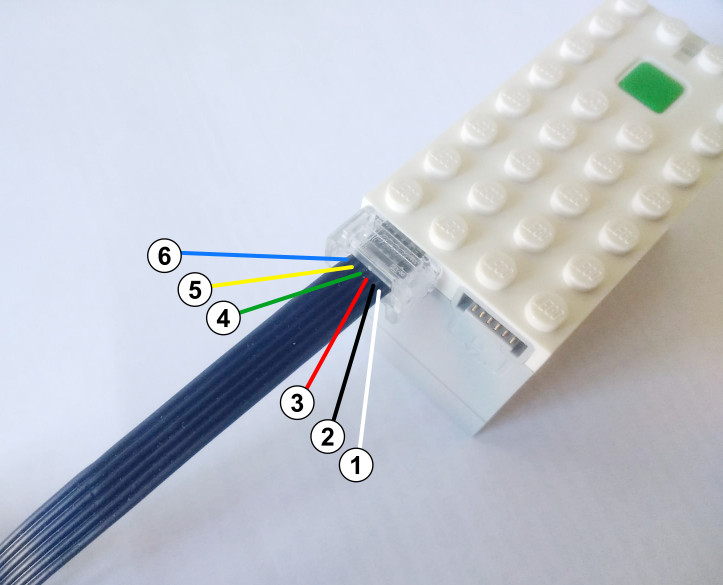

.. pybricks-requirements:: pybricks-iodevices

汎用UARTデバイス
^^^^^^^^^^^^^^^^^^^

Powered UpとEV3は、汎用UARTデバイスのハブへの接続をサポートしています。
ピン配置を以下に示します。コネクターの向きに注意してください。EV3では、
内部のワイヤーの色は下の図と一致しています。

.. list-table::
   :header-rows: 1

   * - ピン
     - Powered Up (UART)
     - EV3（UARTセンサー）
     - EV3（I2Cセンサー）
   * - 1（白）
     - モーター端子1
     - オプションのバッテリー電源
     - オプションのバッテリー電源
   * - 2（黒）
     - モーター端子2
     - なし
     - なし
   * - 3（赤）
     - グランド
     - グランド
     - グランド
   * - 4（緑）
     - VCC (3.3 V)
     - VCC (5 V)
     - VCC (5 V)
   * - 5（黄）
     - ハブ TX（センサー RX）（3.3 V）
     - ハブ TX（センサー RX）（3.3 V）
     - SCL（マスター）（3.3 V）
   * - 6（青）
     - ハブ RX（センサー TX）（3.3 V）
     - ハブ RX（センサー TX）（3.3 V）
     - SDA（マスター）（3.3 V）

.. autoclass:: pybricks.iodevices.UARTDevice

**例: UARTデバイスへの読み取りと書き込み**

.. literalinclude::
   ../../../examples/ev3/uart_basics/main.py
